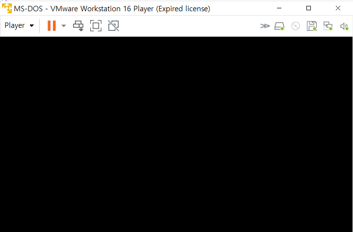
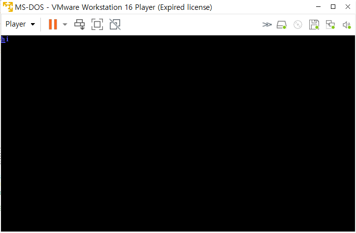

#  부트로더

## 부트 과정

처음 컴퓨터에 전원이 들어와서 부팅과정을 거치는데 이를 부트스트랩이라고 한다. 부트스트랩은 장화(boot)의 끈(strap)을 묶고 일어나려는 사람을 가르키기도 하며 그 과정은 아래와 같다.

1. 컴퓨터에 전원이 켜지고 BIOS가 구동된 뒤 POST 단계
2. CMOS 설정 정보를 읽어 부팅에 필요한 정보 획득(부팅순서)
3. 하드 디스크의 첫번째 섹터에 있는 Mast Boot Record를 검사한 뒤 로드
4. 부트로더가 실행되서 커널을 메모리로 로딩하는 단계(GRUB)
5. 커널이 로드된 이후에는 제어권이 OS로 넘어가게 된다.

## 부트 코드

처음 BIOS가 디스크의 MBR을 읽고 난뒤 가정 처음 실행되는 부분이 부트코드이다. POST과정을 마친 후 부트로더에 의해 MBR의 512바이트가 메모리 0x07C0로 불려진다. 그래서 가장 처음 해야할 일이 메로리 0x07C0로 이동하는 일이다.

--- 코드 설명은 생략 ---

### asm을 img로 변환하는 방법

asm파일이 존재하는 디렉토리에서

```bash
nasm -f bin -o 파일명(img로 변환하고 싶은).asm 파일명(img 파일이름).img
```

### 1번 코드 결과



### 2번 코드 결과



### 끝내며

하드디스크의 512Byte를 읽어와 모니터에 hi를 표시하는 OS가 만들어졌다. 하지만 아직 갈길이 멀다고 느꼈다.