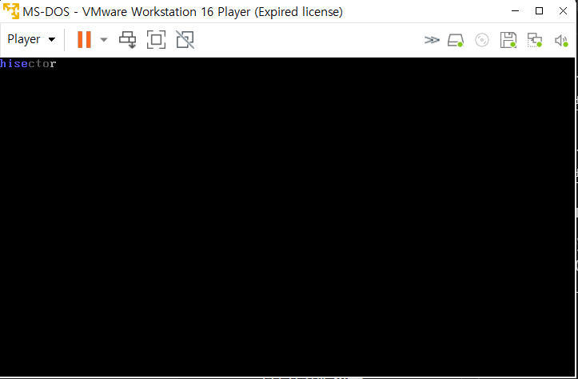

#  하드웨어 읽기

부트로더를 만드는 과정에서 512Byte는 메인보드가 자동으로 읽어 메모리에 옮긴것입니다. 하지만 0.5KB로 어떤걸 할 수 있을까요? OS는 이것보다 커야 할 수 있는 일이 다양해 질것입니다. 그러기 위해서는 하드디스크에 있는 첫번째 섹터 뿐만 아니라 다른 부분도 읽을 줄 알아야합니다.

1장에서 BIOS가 자동으로 읽었던 섹터를 '섹터 1'이라고 합니다. 이 512Byte 코드는 물리주소 0x7C00에 올려져 있었습니다. 다음은 물리주소 0x10000에 '섹터 2'를 올려봅시다.

[org 0x10000]는 이 코드의 시작이 0x10000라는 것을 알리는 것입니다.

--- 이 외의 코드 설명은 생략 ---

### 코드 결과

### 마치며

이렇게 해서 BIOS의 적재 기능없이 우리가 원하는 섹터를 원하는 메모리주소에 올릴수 있게 되었습니다. 다음장은 16비트 환경에서의 오프셋..에 대해서 할 예정입니다. 굉장히 어려운 부분이라 심히 걱정됩니다만 다음장에서 이어나가도록 하겠습니다.