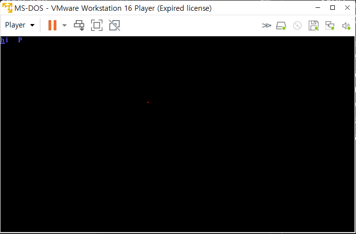

#  리얼모드와 보호모드

x86의 처음에는 16비트 환경이었습니다. (지금은 대부분 32비트거나 64비트)이 환경에서는 세그먼트:오프셋의 계산법이 독특하게 진행됩니다. 예를 들어서 0x0480:0004라는 세그먼트:오프셋 주소가 있다고 합시다. 단순하게 생각해보면 물리주소 0x0484로 매핑되는 것 같습니다. 하지만 16비트 환경(리얼모드)에서는, 세그먼트의 뒷 자리에 0을 붙이고 덧셈을 해야합니다.

## 계산과정

1. 0x0480:0004을  0x0480, 0x0004로 나눈다.
2. 0x0480을 왼쪽으로 한번 쉬프트해서 0x4800로 만들어 준다.
3. 두수를 더한다. 0x4800 + 0x0004 = 0x48004

이렇게 주소값을 얻을 수 있습니다. 

여기서 핵심은 16비트 환경에서 세그먼트:오프셋은 20비트로 변환되어 물리주소에 매핑된다는 것입니다.

1장에서 BIOS가 자동으로 읽었던 섹터를 '섹터 1'이라고 합니다. 이 512Byte 코드는 물리주소 0x7C00에 올려져 있었습니다. 다음은 물리주소 0x10000에 '섹터 2'를 올려봅시다.

[org 0x10000]는 이 코드의 시작이 0x10000라는 것을 알리는 것입니다.

# 보호모드

보호모드는 말그래도 32비트 환경입니다.

16비트를 32비트로 변환해보겠습니다.

이쪽 부분은 나중에 지식이 쌓이면 자연스럽게 이해되는 부분이 있을 것이기 때문에 완벽하게 이해하지않고 대략적으로 이해하려고 노력했습니다.

### 코드작성

boot : 0x10000에 적재 보호모드로 변경 후 0x10000으로 이동

sector : 보호모드 모드에서 P 출력

--- 이 외의 코드 설명은 생략 ---

보호모드 환경에서 OS를 만들수 있게 되었습니다. 이 부분에 대해서는 이해가 어려워서 아래의 링크 글을 참고했습니다.

<https://blog.naver.com/PostView.naver?blogId=simhs93&logNo=221258016792&parentCategoryNo=&categoryNo=40&viewDate=&isShowPopularPosts=false&from=postView>

