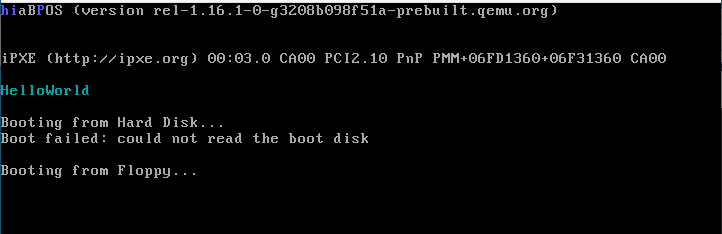

# C언어를 사용해서 개발하기

개발을 하시는 분이라면 어떤 언어를 사용하던 어셈블리어로 변환된 후 기계어로 변환된다는 것을 알고 있을 것입니다. 지금까지 작성한 코드는 모드 어셈블리어를 사용했지만 C언어로 개발한 코드를 어셈블리어로 변환하고 궁극적으로 기계어로 변환해서 우리의 OS 이미지에다 붙이는 작업을 할 것입니다.

## 목표

C언어로 개발을 하여, 소스코드를 기계어로 만들어 통합하는 것입니다. C언어를 기계어로 변환하는 방법은 여러가지가 있지만 여기에선 gcc 컴파일러를 사용할 예정입니다. gcc는 Linux용이기 때문에 가상환경이 필요합니다.

저는 가상환경을 어떻게 구현했는지에 대해선 자세하게 기록해 놓지 않았습니다. 요즘 구글에 검색하면 다 나옵니다!

1. vmware workstation 16 Player를 이용하여 ubuntu 16.04.6을 설치해줍니다.
2. nasm 설치
3. gcc 설치
4. GNU 링커
5. 윈도우와 Linux간의 공유폴더 설정 

[공유폴더 설정 참고 자료](https://m.blog.naver.com/PostView.nhn?blogId=cjh226&logNo=221159795371&proxyReferer=https%3A%2F%2Fwww.google.co.kr%2F)

--- 코드 설명은 생략 ---

### 코드결과

보호모드 환경에서 OS를 만들수 있게 되었습니다. 이 부분에 대해서는 이해가 어려워서 아래의 링크 글을 참고했습니다.

<https://blog.naver.com/PostView.naver?blogId=simhs93&logNo=221258016792&parentCategoryNo=&categoryNo=40&viewDate=&isShowPopularPosts=false&from=postView>

