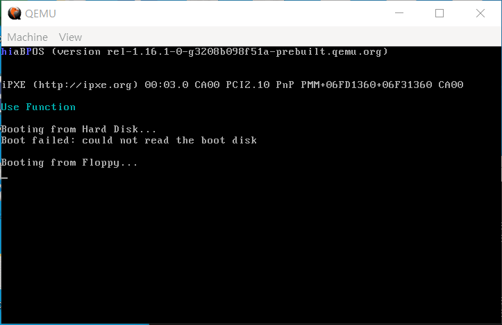

# C언어 함수 만들기

function.c와 function.h를 이용하여 문자열을 출력하는 함수를 만들어 보았습니다. 여기에 대해선 C언어 문법을 이용하기 때문에 설명할 것이 없습니다. 

[[출처] [OS 만들기 7강] C언어로 개발하기|작성자 유리공장장](https://blog.naver.com/PostView.naver?blogId=simhs93&logNo=221262239692&parentCategoryNo=&categoryNo=40&viewDate=&isShowPopularPosts=false&from=postView)

### 코드결과

