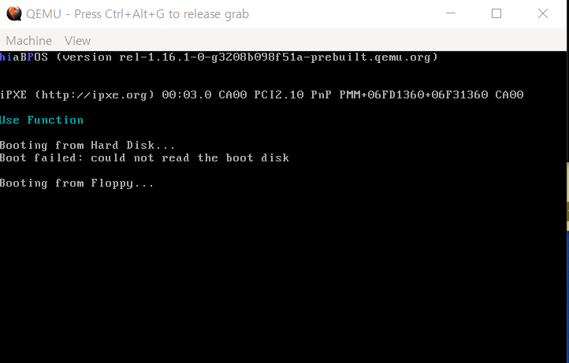

# 인터럽트

인터럽트란? 예를 들어서 사용자가 마우스나 키보드를 만진다고 생각해보자. 컴퓨터는 즉시 사용자가 마우스나 키보드로 입력하는 값들을 즉각적으로 반응하게 된다. 이건 당연한거 아니야라고 생각할수 있다. 그렇다면  컴퓨터가 다른 행동( 프로그램 실행, 동영상 실행 등등 )을 하고 있을때 마우스와 키보드를 만진다고 생각해보자 다른 행동을 하고 있어도 컴퓨터는 사용자의 마우스와 키보드의 입력값에 즉각적으로 반응 한다. 다른 행동을 하고 있을때도 마우스와 키보드의 입력값을 컴퓨터 즉 CPU에 보내주는 것이 인터럽트다 인터럽트가 있기에 컴퓨터가 무언가를 하고 있을때 사용자의 입력값에 대해 즉각적으로 반응 할수 있다.

난해한 내용이라 여러 인터넷의 자료를 참고했습니다.
자세한 설명은 아래를 참조 해주세요.

[[출처] [OS 만들기 5] 인터럽트와 예외](https://kcats.tistory.com/169)

### 코드결과

PIC의 세팅이 끝났습니다. 아 참고로 PIC는 인터럽트의 처리를 담당하는 메인보드의 한부분입니다. 너무 난해한 내용들이 많습니다만.. 일단 인터럽트를 받기위한 세팅은 끝난것 같습니다.