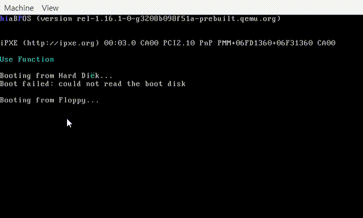

# 키보드 입력받기

가벼운 마음으로 시작한 미니 프로젝트에서 인터럽트 부분을 이해하기 위해
몇일을 허비하니 몸도 마음도 조금 지쳤다.. 사실 인터럽트 부분에 대해서 공부를 하긴했지만 이해했다고 말하기도 부끄러울 수준.. 그래서 여기서부터는 다른 사람의 코드를 참조하여 따라 적는 형식으로 하였습니다. 애초에 프로젝트의 목표는 어셈블리어의 문법이나 컴퓨터의 가장 밑에 단에 처리를 완벽히 이해하려는것이 아니라 최근 직장에서 인베디드 프로그램을 맡게 될꺼같아서 얕고 넓은 이해를 가져가기 위한 것이 었습니다. 심지어 인텔이나 ARM였으면 좋겠지만 완전 별도의 CPU를 사용하기 때문에.. 어쨌든 이제 마무리를 지어야할 때인것 같습니다.

### 2023.1.23코드결과

