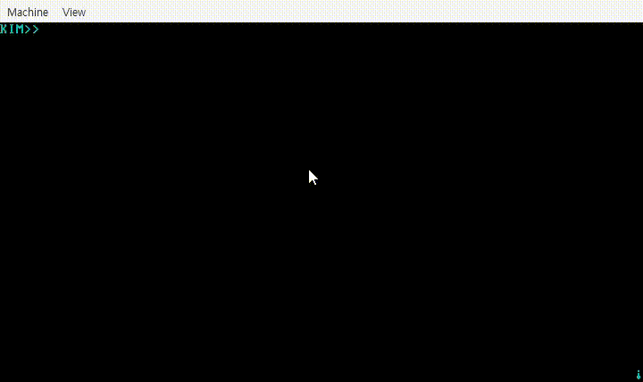

# Sell

I/o는 기초적인 sell을 해서 마무리를 지을려고 합니다.  어셈블리어는 여러가지 어려운 면들이 많아서 그렇게 깊게 이해하진못했습니다.  하지만 전체적인 시스템 베이스와 시스템 인터럽트에 대해서 이해할수 있어서 큰 공부가 되었다고 생각합니다.  다음부터는 좀 더 이어가고 싶지만 저는 더 다양한 프로젝트와 CS공부를 하고 싶기 때문에 일단 여기서 중지하겠습니다.

### 2023.1.26코드결과

